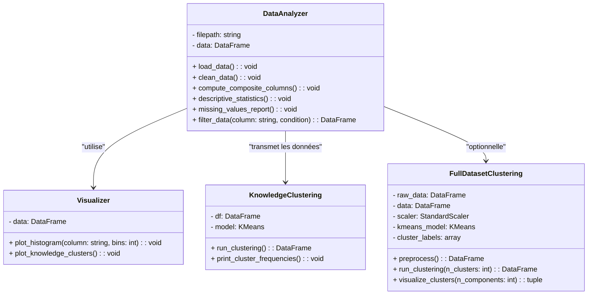

# TP-Programmation-Orient-e-Objet

# Analyse de Données Biologiques ou de Santé avec POO et Pandas

## Description

Ce projet analyse un dataset de santé portant sur l'infertilité masculine en appliquant les principes de la Programmation Orientée Objet (POO) et la bibliothèque **Pandas**. Le dataset (*Male Infertility Data.xlsx*) comporte de nombreuses variables couvrant des aspects démographiques, biologiques et comportementaux de l'infertilité masculine. Le dataset provient de Mendeley Data et est accessible via ce [lien](https://data.mendeley.com/datasets/fyk47fnhfs/1).

Ce projet s'inspire de l'article suivant :

> **Knowledge, Attitudes, Beliefs, and Practices Towards the Causes of Male Infertility Among Urology Outpatients in Abuja Hospitals**  
> Titilola T. Obilade, Peter O. Koleoso, Oluchi A. Eke, Faizat F. Adeniran, Nabila S. Musa, Sa'adah G. Ibrahim  
> [DOI](https://doi.org/10.21203/rs.3.rs-5902036/v1)

Les objectifs incluent :

- Charger et nettoyer un dataset Excel avec **Pandas**.
- Explorer les données à l'aide de statistiques descriptives et d'un histogramme pour la variable `Age`.
- Organiser le code selon les principes de la Programmation Orientée Objet, avec les classes suivantes :
  - **DataAnalyzer** se charge du chargement, du nettoyage et de la création de colonnes composites (notamment **Knowledge_Score** et **Age_Group**).
  - **Visualizer** permet de générer des visualisations (histogrammes, affichage des clusters, etc.).
  - **KnowledgeClustering** effectue un clustering basé uniquement sur le **Knowledge_Score** pour segmenter les patients en trois groupes (Poor, Moderate, Good).
  - **FullDatasetClustering** fournit en complément une analyse globale par clustering sur l’ensemble des variables du dataset.  
    *Cette dernière classe est optionnelle* car elle va au-delà du but principal qui est de segmenter les patients sur la base de leur compréhension (Knowledge_Score).

## Table des Matières

- [Installation](#installation)
- [Utilisation](#utilisation)
- [Structure du Projet](#structure-du-projet)
- [Diagramme de Classes et Explications](#diagramme-de-classes-et-explications)
- [Références](#références)

## Installation

### Prérequis

- Python 3.6 ou version supérieure.
- Bibliothèques requises :
  - `pandas`
  - `seaborn`
  - `matplotlib`
  - `scikit-learn`

Pour installer les dépendances, exécutez :

```bash
pip install pandas seaborn matplotlib scikit-learn
```

### Origine du Dataset

Le dataset est récupéré sur Mendeley Data via ce [lien](https://data.mendeley.com/datasets/fyk47fnhfs/1).

### Téléversement du Dataset

Ce projet est conçu pour être exécuté dans [Google Colab](https://colab.research.google.com/) ou dans un environnement local. Le fichier Excel devra être téléversé lors de l'exécution du script.

## Utilisation

1. **Chargement et Nettoyage des Données**  
   La classe `DataAnalyzer` charge le fichier Excel et nettoie le dataset en remplissant les valeurs manquantes (médiane pour les numériques, mode pour les catégories).

2. **Création de Colonnes Composites**  
   Après le nettoyage, le programme calcule :
   - Le **Knowledge_Score** en sommant les réponses aux questions Q8 à Q14.
   - Le **Age_Group** en regroupant les âges (par exemple, `<=30`, `31-40`, `41-50`, `>=51`).

3. **Analyse Exploratoire**  
   Un histogramme de la variable `Age` est généré pour visualiser la distribution initiale.

4. **Clustering Basé sur le Knowledge_Score**  
   Le processus de clustering extrait et standardise le **Knowledge_Score** puis applique l'algorithme **KMeans** avec `k = 3`.  
   Les clusters obtenus sont triés par ordre croissant des centroïdes et reçoivent les labels :
   - **Poor** pour le cluster avec le centroïde le plus bas.
   - **Moderate** pour le cluster intermédiaire.
   - **Good** pour le cluster avec le centroïde le plus élevé.

   Ce clustering vise une répartition d'environ 25 % de patients avec de faibles connaissances, 67,4 % avec des connaissances modérées et 7,8 % avec de bonnes connaissances.

5. **Fonctionnalités du Clustering (Features)**
   L'analyse de clustering repose principalement sur le Knowledge_Score, une fonctionnalité composite obtenue en faisant la somme des réponses aux questions Q8 à Q14. Ce score quantifie la compréhension des causes de l'infertilité masculine chez chaque patient. La classe KnowledgeClustering standardise ce score et applique l'algorithme KMeans avec k = 3

6. **(Optionnel) Clustering Global**  
   La classe `FullDatasetClustering` offre une analyse complémentaire, en réalisant un clustering sur l'ensemble du dataset après encodage one-hot et standardisation.  
   **Pourquoi cette classe est-elle optionnelle ?**  
   Elle permet d'explorer des patterns supplémentaires en combinant toutes les variables disponibles, mais elle n'est pas indispensable pour atteindre l'objectif principal qui est de segmenter les patients selon leur **Knowledge_Score**.

7. **Visualisation des Résultats**  
   La classe `Visualizer` génère :
   - Un histogramme de la variable `Age`.
   - Un histogramme coloré du **Knowledge_Score** indiquant les clusters (Knowledge_Cluster).

## Structure du Projet

```
├── Male Infertility Data.xlsx
├── README.md
└── programme_POO.ipynb
```

- **main.py :** Contient l'ensemble du code source (classes `DataAnalyzer`, `Visualizer`, `KnowledgeClustering` et `FullDatasetClustering`, ainsi que la fonction principale).
- **README.md :** Ce document.
- **Male Infertility Data.xlsx:** Le dataset à téléverser lors de l'exécution.

## Diagramme de Classes et Explications

Le diagramme ci-dessous représente l'architecture orientée objet du projet :



### Explication du Diagramme

- **DataAnalyzer** : Cette classe est responsable du chargement, du nettoyage et de la préparation des données (y compris la création du **Knowledge_Score** et du **Age_Group**).
- **Visualizer** : Cette classe prend en charge la visualisation des données, telles que l'affichage d'histogrammes pour le `Age` et le **Knowledge_Score**.
- **KnowledgeClustering** : Elle effectue un clustering ciblé basé sur le **Knowledge_Score**, segmentant les patients en trois groupes (Poor, Moderate, Good) à l'aide de l'algorithme **KMeans**.
- **FullDatasetClustering** : Cette classe réalise un clustering sur l’ensemble des variables du dataset après encodage one-hot et standardisation.  
  **Pourquoi cette classe est-elle optionnelle ?**  
  Parce qu’elle fournit une analyse globale complémentaire qui va au-delà de l’objectif principal de segmentation par **Knowledge_Score**. Elle est utile pour ceux qui souhaitent explorer davantage le dataset, mais n'est pas indispensable pour répondre à la problématique principale.

## Références

1. **Article de Référence :**  
   *Knowledge, Attitudes, Beliefs, and Practices Towards the Causes of Male Infertility Among Urology Outpatients in Abuja Hospitals*  
   Titilola T. Obilade, Peter O. Koleoso, Oluchi A. Eke, Faizat F. Adeniran, Nabila S. Musa, Sa'adah G. Ibrahim  
   [DOI](https://doi.org/10.21203/rs.3.rs-5902036/v1)

2. **Documentation :**  
   - [Pandas](https://pandas.pydata.org/docs/)  
   - [Scikit-learn](https://scikit-learn.org/stable/documentation.html)  
   - [Seaborn](https://seaborn.pydata.org/)  
   - [Matplotlib](https://matplotlib.org/stable/contents.html)

## Instructions pour l'Exécution

1. Cloner ou télécharger le dépôt GitHub.
2. Ouvrir le fichier `main.py` dans Google Colab ou un environnement de développement adapté.
3. Téléverser le fichier `Male Infertility Data.xlsx` lors de l'exécution du script.
4. Lancer le script. Le programme chargera et nettoiera les données, générera un histogramme pour la variable `Age`, effectuera le clustering sur le **Knowledge_Score** pour segmenter les patients en trois groupes ("Poor", "Moderate", "Good") et affichera les résultats via des visualisations.
